# tether-wrk-base
A base worker class extending `bfx-wrk-base`.

## Table of Contents

1. [Introduction](#introduction)
2. [Architecture](#architecture)
  1. [Object Model](#object-model)
  2. [Worker Types](#worker-types)
3. [Documentation](#documentation)
4. [Configuration](#configuration)

## Introduction

The `tether-wrk-base` class is designed to initialize and configure services for the base worker. It simplifies the setup of facilities such as service storage and networking, starts an RPC server, and provides methods for handling RPC requests.

## Architecture

### Object Model

The following is a fragment of [Moria object model](https://github.com/tetherto/moria-docs/tree/main/documentation/arch) that contains the abstract class representing "thing" (highlighted in blue). The rounded nodes reprsent abstract classes and the one square node represents a concrete class:

```mermaid
---
title: Object Model of Moria
---
flowchart BT
    bfx-wrk-base@{ shape: stadium, label: "*bfx-wrk-base*" }

    tether-wrk-base@{ shape: stadium, label: "*tether-wrk-base*" }
    tether-wrk-base--->bfx-wrk-base

    moria-tlp-wrk-thing@{ shape: stadium, label: "*moria-tlp-wrk-thing*" }
    moria-tlp-wrk-thing--->tether-wrk-base


    moria-tlp-wrk-electricity@{ shape: stadium, label: "*moria-tlp-wrk-electricity*" }
    moria-tlp-wrk-electricity--->moria-tlp-wrk-thing

    moria-tlp-wrk-switchgear@{ shape: stadium, label: "*moria-tlp-wrk-switchgear*" }
    moria-tlp-wrk-switchgear--->moria-tlp-wrk-thing

    moria-tlp-wrk-miner@{ shape: stadium, label: "*moria-tlp-wrk-miner*" }
    moria-tlp-wrk-miner--->moria-tlp-wrk-thing

    moria-tlp-wrk-container@{ shape: stadium, label: "*moria-tlp-wrk-container*" }
    moria-tlp-wrk-container--->moria-tlp-wrk-thing

    moria-tlp-wrk-powermeter@{ shape: stadium, label: "*moria-tlp-wrk-powermeter*" }
    moria-tlp-wrk-powermeter--->moria-tlp-wrk-thing

    moria-tlp-wrk-sensor@{ shape: stadium, label: "*moria-tlp-wrk-sensor*" }
    moria-tlp-wrk-sensor--->moria-tlp-wrk-thing

    moria-tlp-wrk-minerpool@{ shape: stadium, label: "*moria-tlp-wrk-minerpool*" }
    moria-tlp-wrk-minerpool--->moria-tlp-wrk-thing

    moria-wrk-ext-mempool["moria-wrk-ext-mempool"]
    moria-wrk-ext-mempool--->moria-tlp-wrk-thing

    style tether-wrk-base fill:#005,stroke-width:4px
```




### Worker Types
The system implements a sophisticated multi-level inheritance hierarchy:

#### Inheritance Levels
TODO Verify
```
Level 1: bfx-wrk-base (Foundation)
    ↓
Level 2: tether-wrk-base (Foundation)
    ↓
Level 3: moria-tlp-wrk-thing/WrkProcVar (Thing Management Base)
    ↓
Level 4: Device Category Templates
    ↓
Level 5: Brand/Model Specific Implementations
```

#### Implementation Pattern
TODO Verify
Each level provides increasing specialization:
- **Level 1**: Provides worker infrastructure (lifecycle, facilities, configuration)
- **Level 2**: Provides worker infrastructure (lifecycle, facilities, configuration)
- **Level 3**: Defines abstract methods like `connectThing()`, `collectThingSnap()`
- **Level 4**: May provide default implementations or remain abstract
- **Level 5**: Implements device-specific logic:

Moria implements a hierarchical class structure for different worker types:


To run this worker, the `init()` function must be called in the constructor during the worker's initialization.

The worker is run using `bfx-svc-boot-js`. The initial code is written in `worker.js`, which is used to load the code in `workers/base.wrk.tether.js` via a Bash command:

```bash
node worker.js --wtype tether-wrk-base --env development --debug true
```

For more details, refer to the repository [`bfx-svc-boot-js`](https://github.com/bitfinexcom/bfx-svc-boot-js).


## Documentation

### Methods

#### `init()`

This method initializes the class by:

- Loading the configuration from the `config/common.json` file.
- Setting up facilities for service storage and networking.
- Configuring the logger with the appropriate log level (`debug` or `info`).

#### `getRpcKey()`

This method returns the RPC public key of the worker.

#### `getRpcClientKey()`

This method returns the RPC client key of the worker.

#### `_startRpcServer()`

This method starts the RPC server using the `hp-svc-facs-net` facility. It can be overridden if extra logic is needed while starting the RPC server.

#### `_start(cb)`

This method manages the complete startup process of the worker:

- It calls the parent class's `_start()` method to initialize the base components.
- It starts the RPC server and defines an RPC function `ping` to test if the worker is operational.
- It saves the RPC server's public key in the worker's status.


### Configuration

- Configuration is loaded from the `config/common.json` file.
  Example of `common.json`:

  ```json
  {
    "debug": 0
  }
  ```

  The `debug` key controls the logging level in the worker.

- The class sets up the following facilities:

  - **`hp-svc-facs-store`**: A facility that exposes persistent Holepunch datastores.
    This facility does not require any additional configuration files.

  - **`hp-svc-facs-net`**: A facility that provides access to the Holepunch networking stack (Hyperswarm).
    Its configuration is loaded from `config/facs/net.config.json`.
    Example of `net.config.json`:

    ```json
    {
      "r0": {
        "allow": [],
        "allowLocal": true
      }
    }
    ```

    - **`allow`**: An array used as an allowlist to validate incoming connections based on their `remotePublicKey`.  
    - **`allowLocal`**: If set to `true`, the function allows connections originating from the local IP address.

- The `setup-config.sh` script is used to convert all `config.json.example` files into `config.json`.
